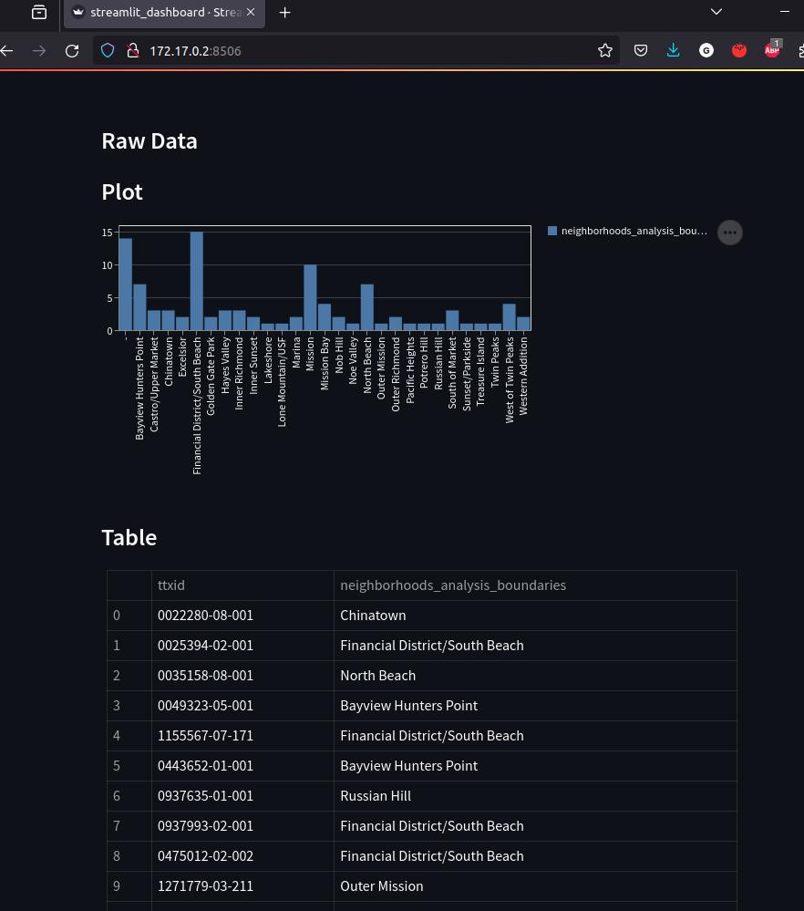

# Project_SFBusiness Overview

Just a simple data pipeline to gather data from an API, upload to MongoDB and show a dashboard.

This project aims to design and implement a solution to process and analyze a dataset, focusing on providing a descriptive statistics dashboard for businesses in San Francisco. The solution includes a data pipeline, cloud-based database, and an interactive dashboard.

## Table of Contents

1. [Project Structure](#project-structure)
2. [Dataset](#dataset)
3. [Methods](#methods)
4. [Evaluation Metrics](#evaluation-metrics)
5. [Results](#results)
6. [Conclusion](#conclusion)
7. [Installation and Setup](#installation-and-setup)
8. [Usage](#usage)
9. [Run Tests](#run-tests)
10. [License](#license)

---

## Project Structure

**Part 1: Solution Design**

Problem Definition: A dashboard displaying business statistics for a specific geographical area, supported by a scalable cloud architecture and a data pipeline.
Data Source: San Francisco's public dataset on registered business locations, accessible via an API from Socrata.
Database Design: A MongoDB NoSQL database is used for scalability and flexibility, with an optimized schema for business, location, and neighborhood data.

**Part 2: Data Processing & Analysis**

ETL Pipeline: The pipeline.py module captures, processes, and stores data from the API into MongoDB.
Exploratory Data Analysis: A simple data analysis and visualization process is shown in the Data Analysis.ipynb notebook.

**Part 3: Optimization & Scalability**

Bottlenecks: The pipeline is fast, but challenges arise in ensuring data consistency when captured and queried.
Scalability: The system is designed to scale both horizontally and vertically using MongoDB, AWS services, and Docker. Lambda functions allow for flexible scaling.

**Part 4: Interactive Dashboards**

Streamlit Dashboard: A lightweight interactive dashboard displays business counts by neighborhood. It's simple but can be extended for real-time analysis.

**Part 5: Documentation & Implementation**

Architecture: The system uses a Python-based pipeline with MongoDB and Streamlit for data processing and dashboard creation.
Deployment: The code can be deployed in a Python environment, using Docker for containerization. MongoDB Atlas is used for the database, with Streamlit handling secret management.
Unit Testing: Unit tests for each module are included but not fully completed.

    /Data_Pipeline_Test_SFBusiness
    ├── Data
    │   └── Registered_Business_Locations_-_San_Francisco_20240120.csv      # Raw dataset
    ├── data_ingestion
    │   ├── dynamodb_insert.py
    │   └── dynamodb_setup.py
    ├── data_processing
    │   ├── redshift_insert.py
    │   └── redshift_setup.py
    ├── Notebooks                   # Jupyter notebook for analysis and visualizations
    │   ├── Data Analysis.ipynb
    │   └── Pipeline_testing.ipynb
    ├── sql_pipeline_borrador
    │   ├── sqlalchemy_uploader.py
    │   ├── sql_create_db.py
    │   ├── sqlite_create_db.py
    │   └── sqlite_uploader.py
    └── Test
    │   ├── test_data_cleaner.py
    │   ├── test_mongodb_updater.py
    │   └── test_pipeline.py
    ├── README.md                   # Project documentation
    ├── LICENSE.md                  # Project licencing
    ├── requirements.txt
    ├── pipeline.py
    ├── data_cleaner.py
    ├── data_fetcher.py
    ├── mongodb_uploader.py
    ├── streamlit_dashboard.py
    └── Prueba Data Engineer.docx.pdf

---

## Dataset

The dataset used in this project is the "Registered Business Locations" dataset for San Francisco, which is publicly available through the City of San Francisco's data portal. It contains information about over 300,000 registered businesses in the city, including details such as business location, ownership, industry classification (NAICS code), and various attributes related to tax and district information. The dataset is accessed through an API provided by Socrata, and its diverse and heterogeneous nature makes it an ideal candidate for analyzing business trends and geographic distribution within the city.

## Methods

The data is first fetched using an **API call** and then processed through an **ETL (Extract, Transform, Load) pipeline**.

The data is cleaned and structured using Python libraries such as Pandas, with missing values handled and relevant transformations applied.

The cleaned data is stored in a **MongoDB** database, chosen for its flexibility in handling semi-structured data.

**Exploratory Data Analysis (EDA)** is performed to generate basic statistics and visualizations, providing insights into the dataset.

The project also includes a simple dashboard implemented using **Streamlit** to visualize business distribution across neighborhoods.

The solution is designed to be scalable, leveraging cloud-based services and functions like **AWS Lambda** for efficient data processing and analysis.

### Evaluation Metrics

no specific evaluation metrics were used as the focus was on designing a prototype and demonstrating the functionality of the data pipeline and dashboard.

- **Data Quality Metrics:** Completeness, consistency, and accuracy of the data, percentage of missing values, duplicated records, or outlier detection.

- **Processing Time:** The time taken to process the data (e.g., from fetching, cleaning, and loading it into the database)

- **Dashboard Performance:** Page load time, response time

- **Scalability:** latency and processing time as the dataset grows.

## Results

**Data Pipeline:** The data pipeline successfully fetches data from the provided API, processes and cleans the data, and loads it into the MongoDB database processing 10,000 records in approximately 1.7 seconds.

**Data Dashboard:** A basic, interactive dashboard showing the number of businesses in different neighborhoods in San Francisco, implemented using Streamlit.

**Data Analysis:** Basic exploratory data analysis (EDA) was performed, providing statistics and the distribution of businesses across neighborhoods.

**System Performance:** The pipeline's is efficient for small datasets, and the dashboard is lightweight but future improvements are needed to handle large-scale data efficiently

**Database Schema:** The MongoDB NoSQL database schema was designed to handle diverse and semi-structured data, new data types or missing values, allowing for flexible scaling.

## Conclusion

The project can be improved by Extending the data analysis to include more complex statistical tests and predictive models, Optimizing the data pipeline to handle larger volumes of data more efficiently, and Enhancing the dashboard to support more advanced visualizations and interactivity.

Deployment Considerations: The project demonstrated a simple deployment environment with Docker and MongoDB Atlas, which could be extended for production environments. However, considerations around data security, load balancing, and fault tolerance would need to be addressed for a fully production-ready system.

**Audience and Technology:**

## Installation and Setup

### 1. Prerequisites

Make sure you have Python 3.8+.

MongoDB: Set up a MongoDB Atlas cluster and update the connection credentials in the code.

### 2. Clone the Repository

To get started, you first need to download the project from GitHub. Open your terminal or Git Bash and run the following command:

```
git clone https://github.com/l-maldonado/Data_Pipeline_Test_SFBusiness.git
```

This will download the entire repository to your local machine.

### 3. Set Up Your Local Environment (Optional)

If you prefer to work locally, it is suggested that you use a virtual environment (virtualenv / Anaconda / docker image)

**Docker (Optional):** Run the project in a Docker container for portability.

```
docker run -p 8888:8888 -v /path/to/project:/home/jovyan/work jupyter/scipy-notebook:latest
docker exec -it <container_id> sh
```

Install the required dependencies:

```
pip install -r requirements.txt
```

Alternatively, You can install the required libraries with this code:

```
pip install pandas matplotlib seaborn missingno folium geopy pymongo streamlit
```

## Usage

Run the pipeline:

```
python3 src/pipeline.py
```

This will launch the app on your browser at http://172.17.0.2:8506



To execute the individual ETL scripts, you can run the Python files in the /src folder directly

```
python src/data_cleaner.py
python src/data_fetcher.py
python src/mongodb_uploader.py
python src/streamlit_dashboard.py
```

### 4. Run the Notebooks on Google Colab (Recommended for Easy Access)

Colab provides a powerful environment with GPU support, so you can run computationally intensive tasks directly in the cloud.
To run the notebooks on Google Colab (no setup required locally), follow these steps:

    Go to Google Colab.
    Click on File > Open notebook.
    Select the GitHub tab, and paste the URL of this repository into the search bar.
    Select the notebook you want to explore.

Now you can run the notebooks on Colab, interact with the datasets, and modify the code as needed.

### 5. Interact with the Datasets and Code

Ensure you have Jupyter Notebook or JupyterLab installed on your machine. If not, you can install it using:

```
pip install notebook
```

After installation, navigate to the project folder and run:

```
jupyter notebook
```

This will open the Jupyter interface in your browser, where you can select and run the notebooks from the /Notebooks folder.

You can run each cell in the notebook to:

- Load and preprocess the data,
- Visualize the results
- Test the individual scripts or the complete pipeline
- Launch the dashboard

## Once the notebook is open, you can start executing the cells to explore the datasets and the statistical techniques used. You can also modify the code to experiment with different approaches or datasets.

## Run tests

Unit tests are included. You can run the tests using Python's built-in unittest framework. Navigate to the project's root directory (if not already there), then run the unit tests using the following command:

```
python -m unittest discover tests
```

This command will search for all test files in the tests directory and execute them.

After running the tests, the output will show you the status of each test (whether it passed or failed). If a test fails, the output will include the traceback to help diagnose the issue.

---

## License

All rights reserved

No Use Without Permission

No Commercial Use

Modification Prohibited

Attribution must be made

See the [LICENSE](LICENSE.md) file for details.

---
